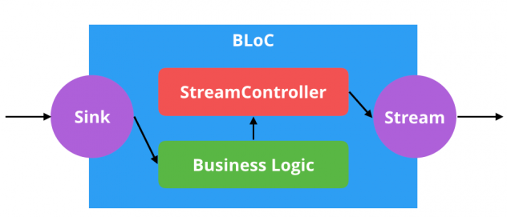

# BLoC Pattern in practice: Find Restaurants

Use case of the popular `BLoC` pattern to architect an Flutter app and manage the flow of data through its widgets using Dart streams.

## Rationale

iOS and Android Developers are well versed in Model-View-Controller (MVC), and have used this pattern as a default choice when building an app. The Model and View are separated, with the Controller sending signals between them.

Flutter, however, brings a new reactive style that is not entirely compatible with MVC. A variation of this classical pattern has emerged from the Flutter community – `BLoC`.

`BLoC` stands for `Business Logic Components`. The gist of `BLoC` is that everything in the app should be represented as stream of events: widgets submit events; other widgets will respond. `BLoC` sits in the middle, managing the conversation. Dart even comes with syntax for working with streams that is baked into the language!

The best part about this pattern is that you won’t need to import any plugins or learn any custom syntax. Flutter already comes with everything you need.

## Flutter Project: Use Case

In this project, we’ve created an app to find restaurants using an API provided by [Zomato](zomato.com). The app should do the following:

- Wrap API calls with the `BLoC` pattern
- Search for restaurants and show the results asynchronously
- Maintain a list of favorite restaurants that can be viewed from multiple screens

## The Anatomy of a BLoC

The BLoC Pattern is really just an interface around Dart streams:



*Streams*, like Futures, are provided by the ```dart:async``` package. A *stream* is like a Future, but instead of returning a single value asynchronously, *streams* can yield multiple values over time. If a Future is a value that will be provided eventually, a *stream* a series of values of that will be provided sporadically over time.

The ```dart:async``` package provides an object called *StreamController*. *StreamControllers* are manager objects that instantiate both a *stream* and a *sink*. A *sink* is the opposite of a *stream*. If a *stream* yields output values over time, a *sink* accepts input values over time.

To summarize, `BLoCs` are objects that process and store business logic, use sinks to accept input, and provide output via streams.

## Credits

This project is a learning exercise from the [raywenderlich.com](https://www.raywenderlich.com/about), which is a very good community site focused on creating high quality computer programming tutorials.

The full tutorial is the reference below:

- [Getting Started with the BLoC Pattern](https://www.raywenderlich.com/4074597-getting-started-with-the-bloc-pattern)

